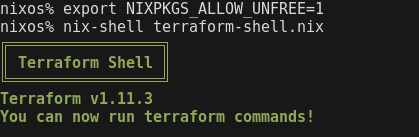
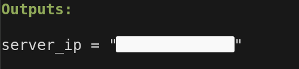
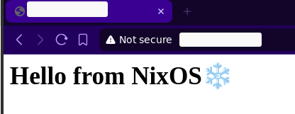

# nixos-server

## Requirements  
- The nix package manager installed. [Install here](https://nixos.org/download/)
- An active Hetzner account [Sign up here to get €20 in credit](https://hetzner.cloud/?ref=VxqsJ799eM9H)


Disclaimer: Hetzner link is a referral link
## Setup
Start of by cloning the repo 
```bash
git clone https://github.com/jasanfarah/nixos-server.git
cd nixos-server
rm -rf .git
git init
```

### 1. SSH key

First, we need to ensure that we have a public SSH key to provide to Terraform. This will ensure that only we (or those with the corresponding private key) can access our server.

You can create an SSH key pair using the following command, which will generate `server.pub` (public key) and `server` (private key):

```bash
ssh-keygen -t rsa -b 4096 -f ~/.ssh/server
```
If you use a different name or already have an SSH key, please update [server.tf](terraform/server.tf#L18) to reflect the correct key name.


### 2. Terraform
To tell hetzner hey! Let me rent a machine, we are going to use terraform.

Start of by changing to the terraform directory

```bash
cd terraform
```

Here lies all terraform related files. I have also added a Nix shell with terraform installed for you to enter.

If you haven't set Nix to allow unfree packages, please do so by running the following command:

```bash
export NIXPKGS_ALLOW_UNFREE=1
```

To enter the shell with terraform run:

```bash
nix-shell terraform-shell.nix 
```

You should enter a shell that looks like this



#### Deploy server with Terraform
First, make sure you have an API key for Hetzner. Read more [here](https://docs.hetzner.com/cloud/api/getting-started/generating-api-token/) on how to set one up

The machine type we are going to deploy is a cx22 which costs €4.11/mo

To deploy a server with terraform change directory to terraform


To see the planned deployment, run

```bash
terraform plan
```


You can now deploy a server by running 
```bash
terraform apply
```

The output should include the IPv4 address of our newly created server like this



You can try to SSH to the server by running
```bash
ssh root@your-ipv4-address
```


**Tip 1:** If you are tired of typing in the Hetzner API key, you can create a file named `terraform.tfvars` in the terraform directory with your API credentials.

**Example:**

```terraform
hetzner_api_key = "your-api-key"
```

**Tip 2:** If you want to delete the deployment run 
```bash
terraform destroy
```

Hop out of the terraform directory once you are done
```bash
cd ..
```

### 3. NixOS prep
As NixOS only remembers whats in the configuration. That also means that if we dont include our public key in the configuration then we cant really access the server anymore.

To keep things simple we wont really use any tools for managing secrets like [sops](https://github.com/getsops/sops), [age](https://github.com/FiloSottile/age) or  [agenix](https://github.com/ryantm/agenix), but you should know their value. 

To prepare our server and restrict SSH access to only us, please manually add your public ssh key in the [firewall](server/firewall.nix#L25) configuration.
### 4. NixOS setup
Now that you have added your own ssh key. We can now setup our server by running following command:

```bash
nix run github:nix-community/nixos-anywhere -- --flake .#server --target-host root@your-ipv4-address
```


After a bit you should get a message that everything was setup and you can now try to ssh into the server.

### 5. NixOS deploy changes (Requires running NixOS)

```bash
nixos-rebuild switch --flake .#server --target-host root@your-ipv4-address
```

### Optional

Want to run a reverse proxy like caddy? Uncomment the line in [configuration.nix](server/configuration.nix#L8) to include the reverse proxy in our configuration.


If you have NixOS running on your machine, run the command to rebuild the server with your new changes:
```bash
nixos-rebuild switch --flake .#server --target-host root@your-ipv4-address
```

If not just rebuild the whole thing from stratch 
```bash
nix run github:nix-community/nixos-anywhere -- --flake .#server --target-host root@your-ipv4-address
```
Be aware all existing data gets deleted and this takes much more time

You should now have something running on your server.

Try to curl it or visit it
```bash
curl http://your-ipv4-address/
```




Check out the [reverse-proxy.nix](server/reverse-proxy.nix), and customize it to your needs. A little googling will be needed if you want to enable SSL/TLS.

## Notes

Thoughts: 
* Maybe setup bastion host which runs NixOS to be able to run the rebuild-switch command? 
* Provide example of pull based approach and push based??
* Learn more about Morph and Colmena

TODO:
* Disable ssh for root, add another user named grug
* Add docker as non root
* Persistence
* More hardening
* Fix stuff with filesystem warning
* CI/CD example?

### Credit:

[Luiz Eduardo Kowalski - Terraform Hetzner](https://github.com/luizkowalski/terraform-hetzner)